# DiagramLab

> **A browser-based workspace for creating, editing, and documenting technical diagrams.**

[](https://react.dev/)
[](https://www.typescriptlang.org/)
[](https://vite.dev/)
[](https://nodejs.org/)
[](https://expressjs.com/)
[](LICENSE)

---

## Overview

**DiagramLab** is a technical diagram workspace built for creating clear, editable, and structured visual documentation directly in the browser.

The application brings diagram editing, reusable templates, project organization, export workflows, local persistence, and AI-assisted diagram generation into a single workspace.

It is designed for software architecture, system design, engineering documentation, process visualization, database modeling, UML-style diagrams, and technical communication.

---

## Product Flow

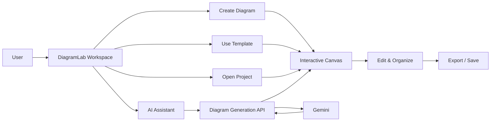

---

## Core Capabilities

### Diagram Workspace

* Interactive diagram canvas
* Editable nodes and connectors
* Node positioning and manipulation
* Structured diagram relationships
* Multiple diagram styles
* Technical documentation-oriented layout

### Diagram Types

* Software architecture
* System architecture
* Flowcharts
* Process diagrams
* UML-style diagrams
* Database schemas
* Service and infrastructure diagrams
* Technical workflows

### Templates

Reusable starting points for common technical scenarios.

Templates provide predefined diagram structures that can be edited and extended within the workspace.

### Project Workspace

DiagramLab provides browser-based project organization for working with multiple diagrams.

Projects can be created, opened, edited, duplicated, and managed from the application workspace.

### Export

Diagrams can be transformed into presentation and documentation-ready outputs through the application's export workflows.

### Themes

The interface supports:

* Light mode
* Dark mode

The visual system is designed for both focused editing and technical presentation.

---

# AI-Assisted Diagram Generation

DiagramLab includes an optional AI workflow for converting natural-language system descriptions into structured diagrams.

Instead of manually creating every component, users can describe a system in natural language and receive a structured diagram that can then be edited inside the canvas.

## AI Flow

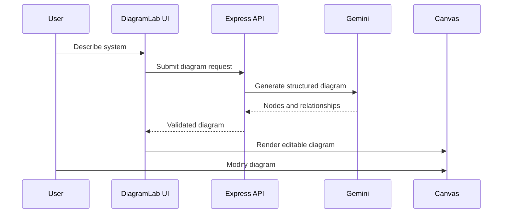

The AI workflow is designed around **structured diagram data rather than generated images**, allowing generated results to remain editable.

---

# Application Architecture

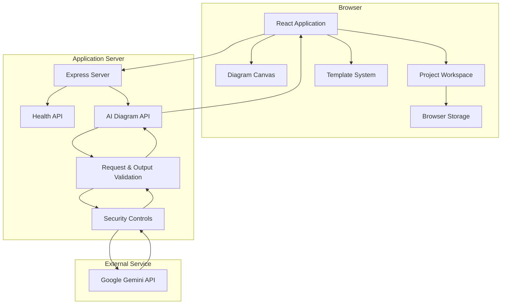

---

# Diagram Generation Flow

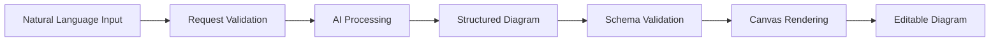

The generated result is processed as structured diagram data before being rendered by the editor.

This allows users to continue modifying the generated architecture instead of receiving a static image.

---

# Editing Flow

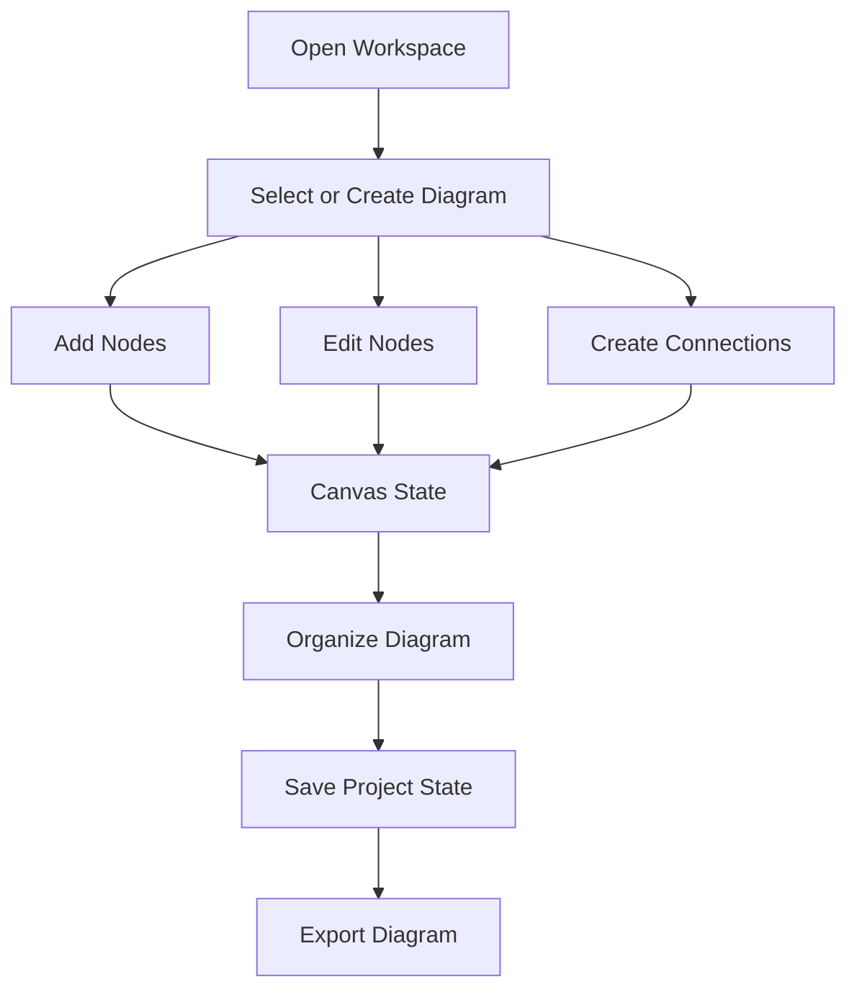

---

# Project Data Flow

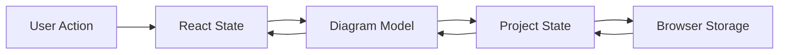

Project data is primarily maintained in the browser, allowing the workspace to preserve diagram state without requiring a dedicated application database.

---

# Security Architecture

DiagramLab separates browser functionality from server-side AI communication.

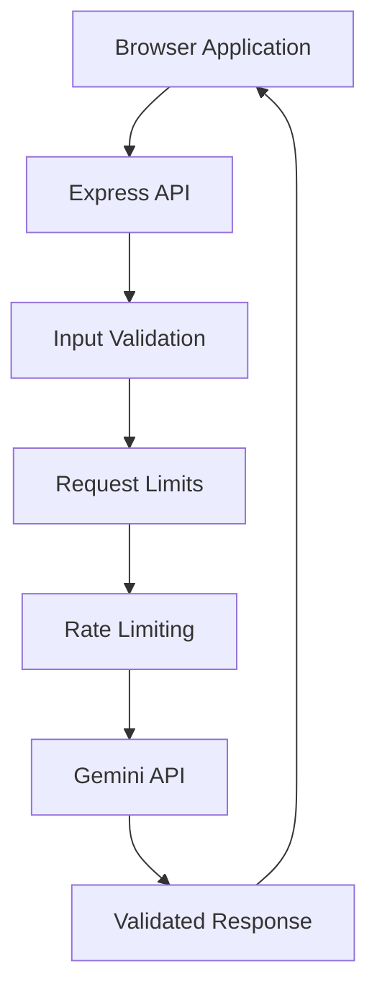

The AI provider credential remains on the server side rather than being embedded into the browser application.

Security controls include:

* Server-side API credential handling
* Request validation
* Request body-size limits
* Prompt length restrictions
* Input sanitization
* AI endpoint rate limiting
* Generated diagram validation
* Diagram relationship validation
* Output field limits
* Security response headers
* Reduced server information exposure

---

# Fallback Generation

DiagramLab also supports a local fallback workflow when external AI generation is unavailable.

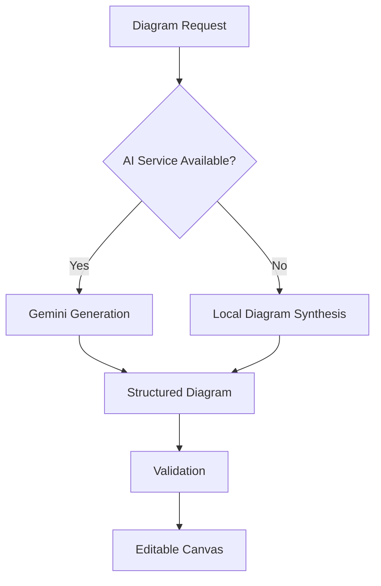

This keeps the diagram creation workflow usable even when the external AI service cannot complete a request.

---

# Technology Stack

| Layer              | Technology            |
| ------------------ | --------------------- |
| Frontend           | React 19              |
| Language           | TypeScript            |
| Build Tool         | Vite                  |
| Styling            | Tailwind CSS          |
| Icons              | Lucide React          |
| Animation          | Motion                |
| Backend            | Node.js               |
| API Layer          | Express               |
| AI Integration     | Google Gemini         |
| Client Persistence | Browser Local Storage |
| Deployment Model   | Web Service           |

---

# Frontend Architecture

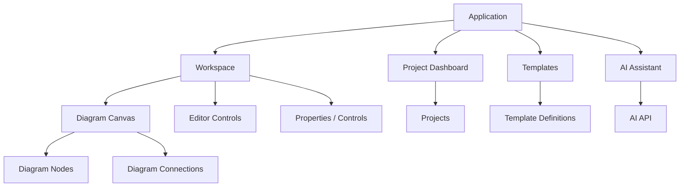

---

# Backend Architecture

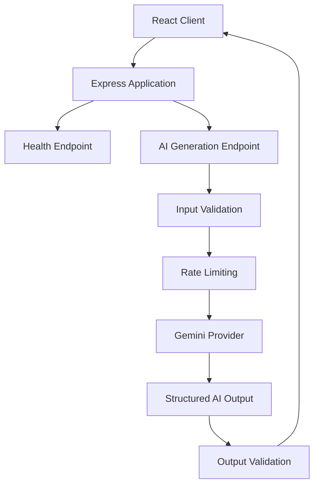

---

# Project Structure

```text
DiagramLab/
│
├── src/
│   ├── components/
│   ├── lib/
│   ├── shapes/
│   ├── templates/
│   ├── types/
│   ├── App.tsx
│   └── main.tsx
│
├── server.ts
├── index.html
├── metadata.json
├── package.json
├── tsconfig.json
├── vite.config.ts
│
├── .env.example
├── .gitignore
├── render.yaml
├── SECURITY.md
├── LICENSE
└── README.md
```

---

# Application Layers

```text
┌─────────────────────────────────────────────┐
│                  DiagramLab                 │
├─────────────────────────────────────────────┤
│              Presentation Layer             │
│        React • UI • Themes • Controls       │
├─────────────────────────────────────────────┤
│               Workspace Layer               │
│      Canvas • Nodes • Edges • Projects      │
├─────────────────────────────────────────────┤
│                Data Layer                   │
│        Diagram Model • Local Storage        │
├─────────────────────────────────────────────┤
│                 API Layer                   │
│       Express • Validation • Rate Limit     │
├─────────────────────────────────────────────┤
│               AI Integration                │
│                 Gemini API                  │
└─────────────────────────────────────────────┘
```

---

# Design Principles

DiagramLab is built around several core principles:

### Editable First

Generated and manually created diagrams remain structured and editable rather than being treated as static images.

### Structured Data

Diagram elements are represented as structured nodes and relationships, enabling manipulation, validation, and export.

### Browser-Centered

The primary editing experience runs directly in the browser.

### Secure AI Integration

External AI credentials are handled server-side rather than exposed through the client application.

### Practical Technical Documentation

The interface is designed around real-world engineering diagrams rather than purely visual drawing.

### Minimal Infrastructure

Browser persistence reduces the infrastructure required for basic project usage.

---

# Use Cases

DiagramLab can be used for:

* Software architecture planning
* System design documentation
* Database modeling
* API architecture visualization
* Infrastructure diagrams
* Application workflows
* Process documentation
* UML-style modeling
* Engineering presentations
* Technical project documentation
* AI-assisted architecture exploration

---

# Key Workflow

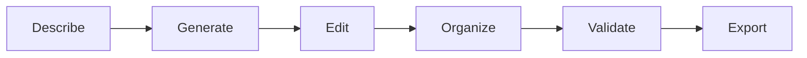

**Describe → Generate → Edit → Organize → Validate → Export**

---

# Security Model

DiagramLab treats the browser and external AI provider as separate trust boundaries.

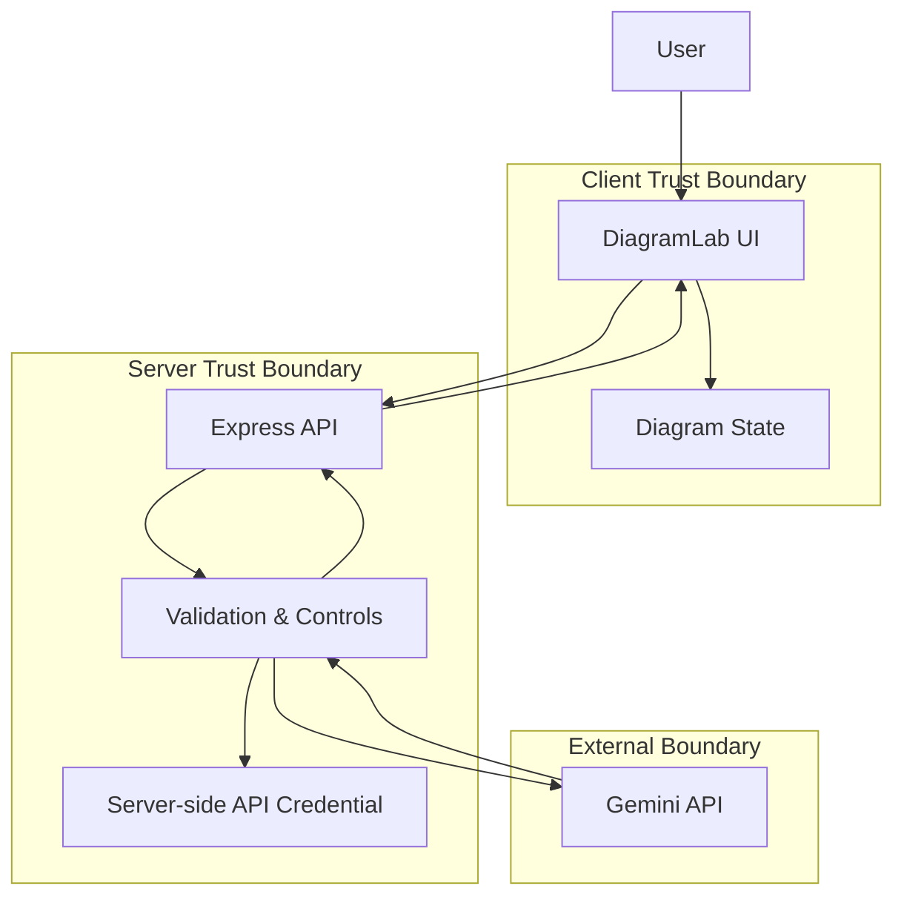

This separation prevents the AI provider credential from becoming part of the client-side application bundle.

---

# Summary

DiagramLab brings together:

* Interactive technical diagram editing
* Architecture and workflow visualization
* Reusable diagram templates
* Browser-based project management
* Local project persistence
* Export workflows
* Dark and light themes
* AI-assisted structured diagram generation
* Local fallback generation
* Server-side AI integration
* Request and output validation
* Application-level security controls

The result is a focused technical workspace for creating **editable, structured, and documentation-ready diagrams directly in the browser**.

---

<div align="center">

**DiagramLab**

*Create. Structure. Visualize.*

</div>
